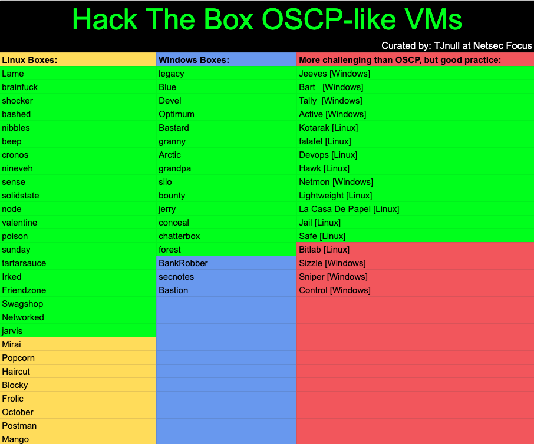

# Introduction

Hi there! If you don't know me, my name is Rana Khalil and I go by the twitter handle [**@rana\_\_khalil**](https://twitter.com/rana__khalil). After spending close to eight months studying for the Offensive Security Certified Professional \(OSCP\) certification, I'm happy to announce that I'm officially OSCP certified! 

My primary source of preparation was [**TJ\_Null's list of Hack The Box OSCP-like VMs**](https://docs.google.com/spreadsheets/u/1/d/1dwSMIAPIam0PuRBkCiDI88pU3yzrqqHkDtBngUHNCw8/htmlview#) shown in the below image. As I went through the machines, I wrote writeups/blogs on how to solve each box on [**Medium**](https://medium.com/@ranakhalil101). I originally started blogging to confirm my understanding of the concepts that I came across. As the saying goes _"If you can't explain it simply, you don't understand it well enough_". And to say that that was the only benefit from the blogs would be an understatement. The writeups also served as a way to review my knowledge before the OSCP exam and as a way to easily search for commands/concepts during the exam. It also came as a surprise that so many individual like myself who were preparing for the OSCP exam have been reading my blogs. For the past five months, my Medium blogs have been averaging on over 21,000 views per month! 

After passing the OSCP exam, I received a countless number of requests asking me to migrate my writeups to another platform for several reasons that I won't get into here. Therefore, although Medium will still be my official blogging platform, I have migrated all my writeups of TJ\_Null's list of Hack the Box OSCP-like VMs to this [**GitBook**](https://rana-khalil.gitbook.io/hack-the-box-oscp-preparation/) that is also backed up on this public [**GitHub repo**](https://github.com/rkhal101/Hack-the-Box-OSCP-Preparation). 

Before I enrolled in the OSCP labs, I completed all 47 boxes \(highlighted in green\) that were listed in TJ\_Null's list. However, the list did get updated several times since then with an added number of 15 boxes. Since I am currently studying for the Advanced Web Attacks and Exploitation \(AWAE\) certification and several of the unsolved boxes are relevant to that certification, I will be adding writeups for these boxes. I'm also working on posting a review of the OSCP certification that will be added here.

Hope you enjoy the writeups and feel free to get in touch with me if you have any questions / suggestions! 

