# HTB Linux Boxes

List of HTB Linux boxes that are similar to the OSCP labs.

<table>
  <thead>
    <tr>
      <th style="text-align:center"> <a href="lame-writeup-w-o-metasploit.md"><b>Lame</b></a>&lt;b&gt;&lt;/b&gt;</th>
      <th
      style="text-align:center">&lt;b&gt;&lt;/b&gt;<a href="brainfuck-writeup-w-o-metasploit.md"><b>Brainfuck</b></a><b>   </b>
        </th>
    </tr>
  </thead>
  <tbody>
    <tr>
      <td style="text-align:center">
         &#x200B;
        
      </td>
      <td style="text-align:center">
        

        

          
        

      </td>
    </tr>
    <tr>
      <td style="text-align:center">&lt;b&gt;&lt;/b&gt;<a href="shocker-writeup-w-o-metasploit.md"><b>Shocker</b></a>&lt;b&gt;&lt;/b&gt;</td>
      <td
      style="text-align:center">&lt;b&gt;&lt;/b&gt;<a href="https://rana-khalil.gitbook.io/tj-null-s-hack-the-box-oscp-like-vms/linux-boxes/bashed-writeup-w-o-metasploit"><b>Bashed</b></a>&lt;b&gt;&lt;/b&gt;</td>
    </tr>
    <tr>
      <td style="text-align:center">
        

        

          
        

      </td>
      <td style="text-align:center">
        

        

          
        

      </td>
    </tr>
    <tr>
      <td style="text-align:center">&lt;b&gt;&lt;/b&gt;<a href="nibbles-writeup-w-o-metasploit.md"><b>Nibbles</b></a>&lt;b&gt;&lt;/b&gt;</td>
      <td
      style="text-align:center">&lt;b&gt;&lt;/b&gt;<a href="beep-writeup-w-o-metasploit.md"><b>Beep</b></a>&lt;b&gt;&lt;/b&gt;</td>
    </tr>
    <tr>
      <td style="text-align:center">
        

        

          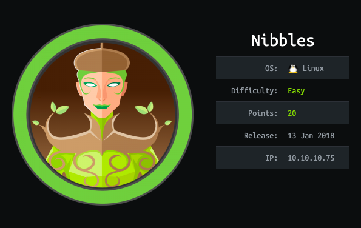
        

      </td>
      <td style="text-align:center">
        

        

          
        

      </td>
    </tr>
    <tr>
      <td style="text-align:center">&lt;b&gt;&lt;/b&gt;<a href="cronos-writeup-w-o-metasploit.md"><b>Cronos</b></a>&lt;b&gt;&lt;/b&gt;</td>
      <td
      style="text-align:center"><a href="nineveh-writeup-w-o-metasploit.md"><b>Nineveh</b></a>&lt;b&gt;&lt;/b&gt;</td>
    </tr>
    <tr>
      <td style="text-align:center">
        

        

          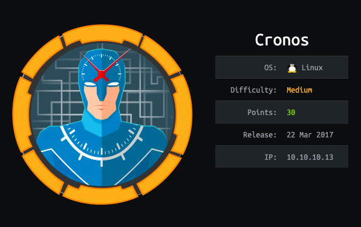
        

      </td>
      <td style="text-align:center">
        

        

          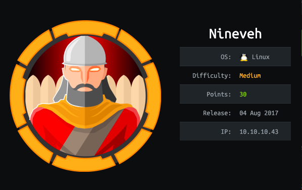
        

      </td>
    </tr>
    <tr>
      <td style="text-align:center">&lt;b&gt;&lt;/b&gt;<a href="sense-writeup-w-o-metasploit.md"><b>Sense</b></a>&lt;b&gt;&lt;/b&gt;</td>
      <td
      style="text-align:center"><a href="solidstate-writeup-w-o-metasploit.md"><b>SolidState</b></a>&lt;b&gt;&lt;/b&gt;</td>
    </tr>
    <tr>
      <td style="text-align:center">
        

        

          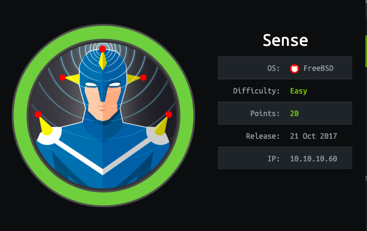
        

      </td>
      <td style="text-align:center">
        

        

          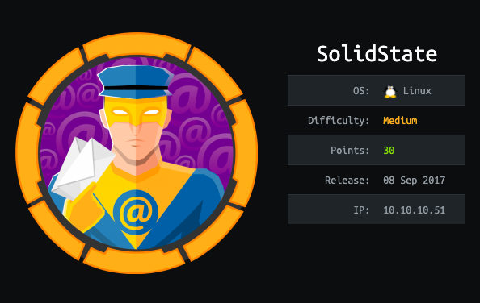
        

      </td>
    </tr>
    <tr>
      <td style="text-align:center">&lt;b&gt;&lt;/b&gt;<a href="node-writeup-w-o-metasploit.md"><b>Node</b></a>&lt;b&gt;&lt;/b&gt;</td>
      <td
      style="text-align:center">&lt;b&gt;&lt;/b&gt;<a href="valentine-writeup-w-o-metasploit.md"><b>Valentine</b></a>&lt;b&gt;&lt;/b&gt;</td>
    </tr>
    <tr>
      <td style="text-align:center">
        

        

          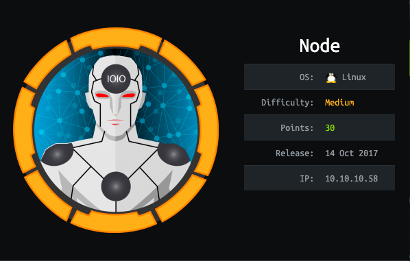
        

      </td>
      <td style="text-align:center">
        

        

          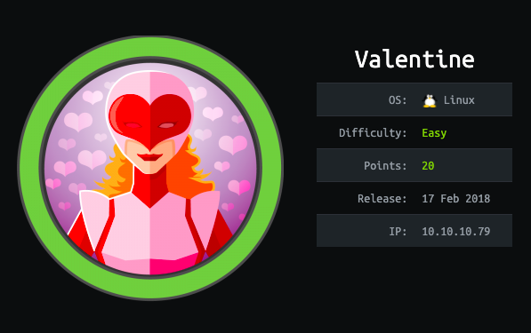
        

      </td>
    </tr>
    <tr>
      <td style="text-align:center">&lt;b&gt;&lt;/b&gt;<a href="poison-writeup-w-o-metasploit.md"><b>Poison</b></a>&lt;b&gt;&lt;/b&gt;</td>
      <td
      style="text-align:center"><a href="sunday-writeup-w-o-metasploit.md"><b>Sunday</b></a>&lt;b&gt;&lt;/b&gt;</td>
    </tr>
    <tr>
      <td style="text-align:center">
        

        

          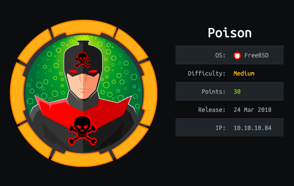
        

      </td>
      <td style="text-align:center">
        

        

          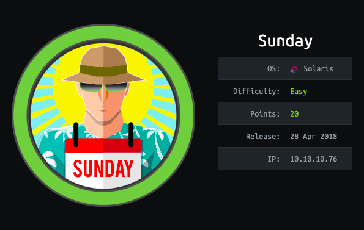
        

      </td>
    </tr>
    <tr>
      <td style="text-align:center">&lt;b&gt;&lt;/b&gt;<a href="tartarsauce-writeup-w-o-metasploit.md"><b>TartarSauce</b></a>&lt;b&gt;&lt;/b&gt;</td>
      <td
      style="text-align:center">&lt;b&gt;&lt;/b&gt;<a href="irked-writeup-w-o-metasploit.md"><b>Irked</b></a>&lt;b&gt;&lt;/b&gt;</td>
    </tr>
    <tr>
      <td style="text-align:center">
        

        

          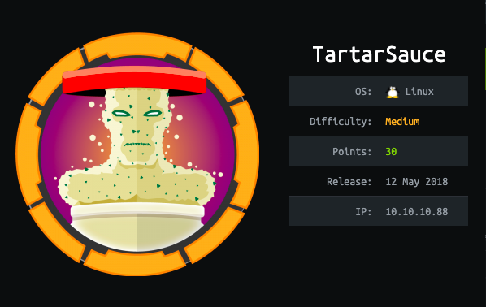
        

      </td>
      <td style="text-align:center">
        

        

          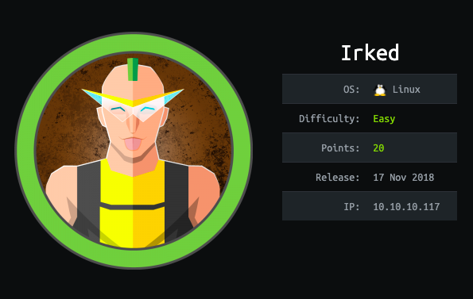
        

      </td>
    </tr>
    <tr>
      <td style="text-align:center">&lt;b&gt;&lt;/b&gt;<a href="friendzone-writeup-w-o-metasploit.md"><b>FriendZone</b></a>&lt;b&gt;&lt;/b&gt;</td>
      <td
      style="text-align:center">&lt;b&gt;&lt;/b&gt;<a href="swagshop-writeup-w-o-metasploit.md"><b>SwagShop</b></a>&lt;b&gt;&lt;/b&gt;</td>
    </tr>
    <tr>
      <td style="text-align:center">
        

        

          
        

      </td>
      <td style="text-align:center">
        

        

          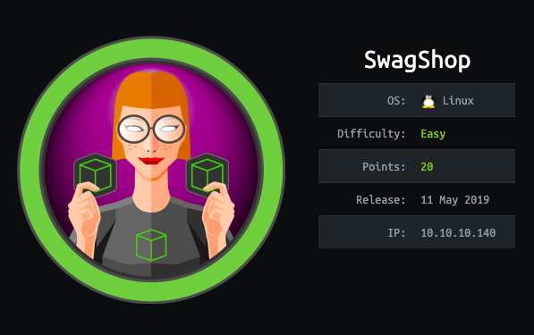
        

      </td>
    </tr>
    <tr>
      <td style="text-align:center">&lt;b&gt;&lt;/b&gt;<a href="networked-writeup-w-o-metasploit.md"><b>Networked</b></a>&lt;b&gt;&lt;/b&gt;</td>
      <td
      style="text-align:center">&lt;b&gt;&lt;/b&gt;<a href="jarvis-writeup-w-o-metasploit.md"><b>Jarvis</b></a>&lt;b&gt;&lt;/b&gt;</td>
    </tr>
    <tr>
      <td style="text-align:center">
        

        

          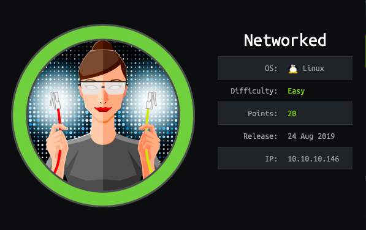
        

      </td>
      <td style="text-align:center">
        

        

          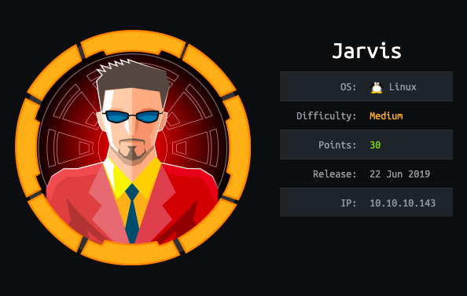
        

      </td>
    </tr>
  </tbody>
</table>