# More Challenging than OSCP HTB Boxes

List of HTB Linux & Windows boxes that are more challenging than the OSCP labs, but still good practice.

<table>
  <thead>
    <tr>
      <th style="text-align:center">&lt;b&gt;&lt;/b&gt;<a href="jeeves-writeup-w-o-metasploit.md"><b>Jeeves </b></a>&lt;b&gt;&lt;/b&gt;</th>
      <th
      style="text-align:center">&lt;b&gt;&lt;/b&gt;<a href="bart-writeup-w-o-metasploit.md"><b>Bart</b></a>&lt;b&gt;&lt;/b&gt;</th>
    </tr>
  </thead>
  <tbody>
    <tr>
      <td style="text-align:center">
        

        

          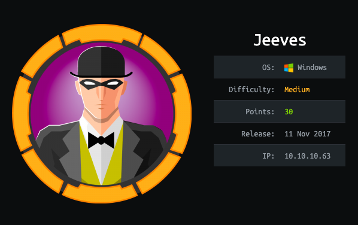
        

      </td>
      <td style="text-align:center">
        

        

          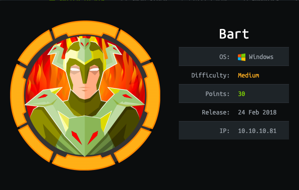
        

      </td>
    </tr>
    <tr>
      <td style="text-align:center">&lt;b&gt;&lt;/b&gt;<a href="tally-writeup-w-o-metasploit.md"><b>Tally</b></a>&lt;b&gt;&lt;/b&gt;</td>
      <td
      style="text-align:center">&lt;b&gt;&lt;/b&gt;<a href="active-writeup-w-o-metasploit.md"><b>Active</b></a>&lt;b&gt;&lt;/b&gt;</td>
    </tr>
    <tr>
      <td style="text-align:center">
        

        

          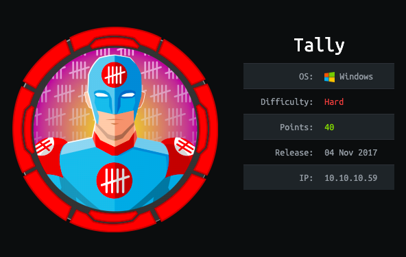
        

      </td>
      <td style="text-align:center">
        

        

          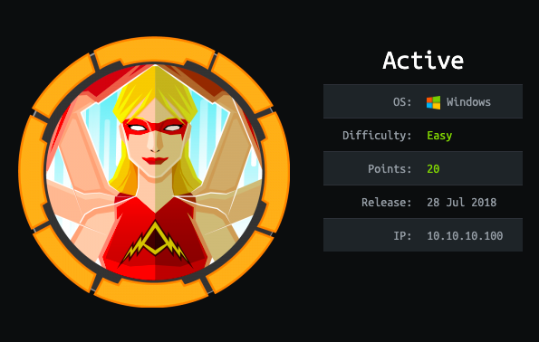
        

      </td>
    </tr>
    <tr>
      <td style="text-align:center">&lt;b&gt;&lt;/b&gt;<a href="kotarak-writeup-w-o-metasploit.md"><b>Kotarak</b></a>&lt;b&gt;&lt;/b&gt;</td>
      <td
      style="text-align:center">&lt;b&gt;&lt;/b&gt;<a href="falafel-writeup-w-o-metasploit.md"><b>Falafel</b></a>&lt;b&gt;&lt;/b&gt;</td>
    </tr>
    <tr>
      <td style="text-align:center">
        

        

          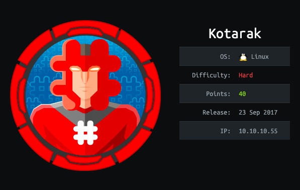
        

      </td>
      <td style="text-align:center">
        

        

          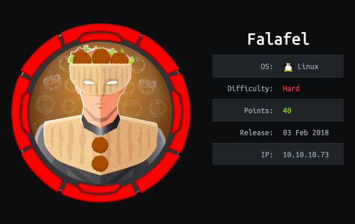
        

      </td>
    </tr>
    <tr>
      <td style="text-align:center">&lt;b&gt;&lt;/b&gt;<a href="devoops-writeup-w-o-metasploit.md"><b>DevOops</b></a>&lt;b&gt;&lt;/b&gt;</td>
      <td
      style="text-align:center">&lt;b&gt;&lt;/b&gt;<a href="hawk-writeup-w-o-metasploit.md"><b>Hawk</b></a>&lt;b&gt;&lt;/b&gt;</td>
    </tr>
    <tr>
      <td style="text-align:center">
        

        

          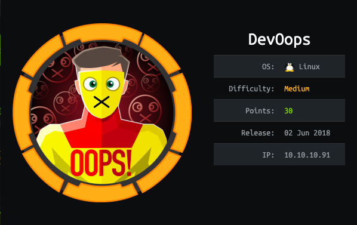
        

      </td>
      <td style="text-align:center">
        

        

          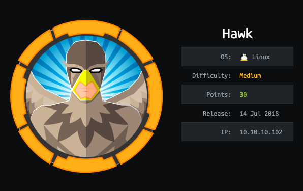
        

      </td>
    </tr>
    <tr>
      <td style="text-align:center">&lt;b&gt;&lt;/b&gt;<a href="netmon-writeup-w-o-metasploit.md"><b>Netmon</b></a>&lt;b&gt;&lt;/b&gt;</td>
      <td
      style="text-align:center">&lt;b&gt;&lt;/b&gt;<a href="lightweight-writeup-w-o-metasploit.md"><b>Lightweight</b></a>&lt;b&gt;&lt;/b&gt;</td>
    </tr>
    <tr>
      <td style="text-align:center">
        

        

          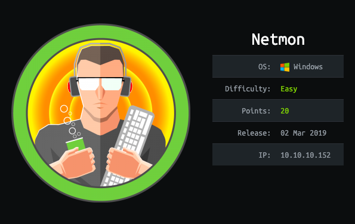
        

      </td>
      <td style="text-align:center">
        

        

          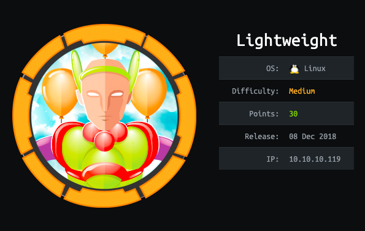
        

      </td>
    </tr>
    <tr>
      <td style="text-align:center">&lt;b&gt;&lt;/b&gt;<a href="lacasadepapel-writeup-w-o-metasploit.md"><b>LaCasaDePapel</b></a>&lt;b&gt;&lt;/b&gt;</td>
      <td
      style="text-align:center">&lt;b&gt;&lt;/b&gt;<a href="jail-writeup-w-o-metasploit.md"><b>Jail</b></a>&lt;b&gt;&lt;/b&gt;</td>
    </tr>
    <tr>
      <td style="text-align:center">
        

        

          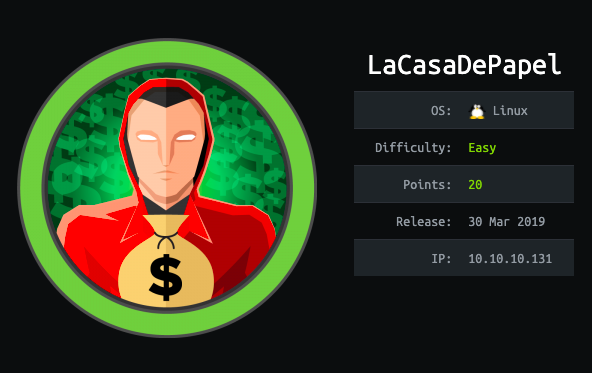
        

      </td>
      <td style="text-align:center">
        

        

          
        

      </td>
    </tr>
    <tr>
      <td style="text-align:center">&lt;b&gt;&lt;/b&gt;<a href="safe-writeup-w-o-metasploit.md"><b>Safe</b></a>&lt;b&gt;&lt;/b&gt;</td>
      <td
      style="text-align:center"></td>
    </tr>
    <tr>
      <td style="text-align:center">
        

        

          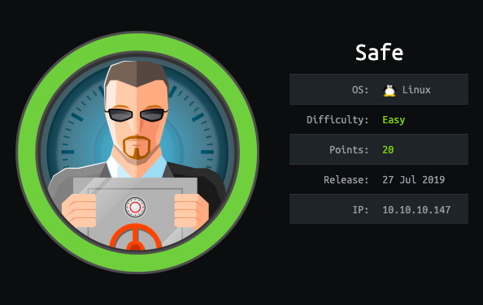
        

      </td>
      <td style="text-align:center"></td>
    </tr>
  </tbody>
</table>