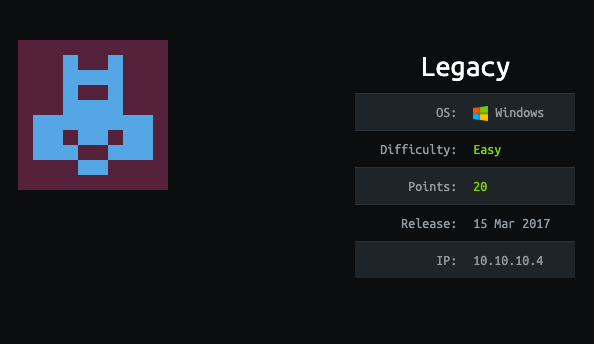
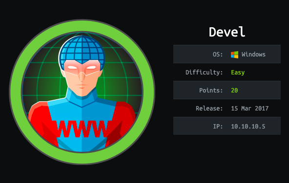
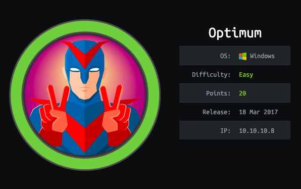
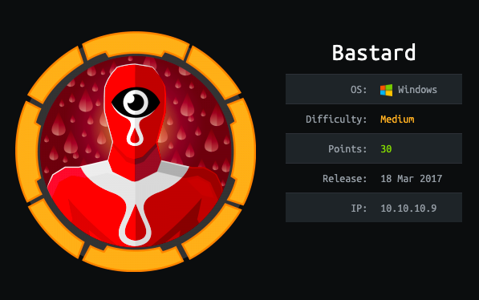
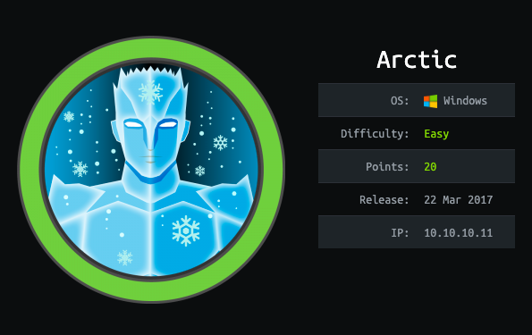
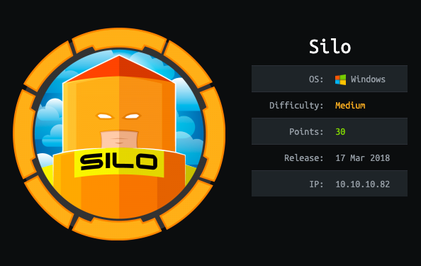
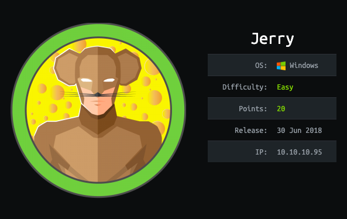
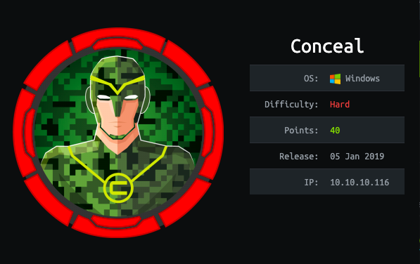
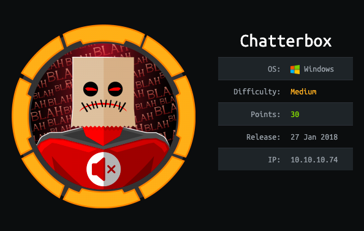
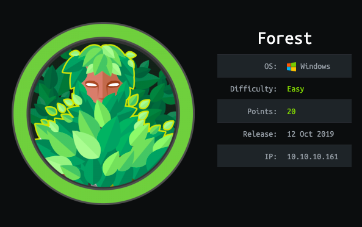

# HTB Windows Boxes

List of HTB Windows boxes that are similar to the OSCP labs.

<table>
  <thead>
    <tr>
      <th style="text-align:center">&lt;b&gt;&lt;/b&gt;<a href="legacy-writeup-w-o-metasploit.md"><b>Legacy</b></a>&lt;b&gt;&lt;/b&gt;</th>
      <th
      style="text-align:center">&lt;b&gt;&lt;/b&gt;<a href="blue-writeup-w-o-metasploit.md"><b>Blue</b></a>&lt;b&gt;&lt;/b&gt;</th>
    </tr>
  </thead>
  <tbody>
    <tr>
      <td style="text-align:center">
        

        

          
        

      </td>
      <td style="text-align:center">
        

        

          
        

      </td>
    </tr>
    <tr>
      <td style="text-align:center">&lt;b&gt;&lt;/b&gt;<a href="devel-writeup-w-o-metasploit.md"><b>Devel</b></a>&lt;b&gt;&lt;/b&gt;</td>
      <td
      style="text-align:center">&lt;b&gt;&lt;/b&gt;<a href="optimum-writeup-w-o-metasploit.md"><b>Optimum</b></a>&lt;b&gt;&lt;/b&gt;</td>
    </tr>
    <tr>
      <td style="text-align:center">
        

        

          
        

      </td>
      <td style="text-align:center">
        

        

          
        

      </td>
    </tr>
    <tr>
      <td style="text-align:center">&lt;b&gt;&lt;/b&gt;<a href="bastard-writeup-w-o-metasploit.md"><b>Bastard</b></a>&lt;b&gt;&lt;/b&gt;</td>
      <td
      style="text-align:center">&lt;b&gt;&lt;/b&gt;<a href="granny-writeup-w-o-and-w-metasploit.md"><b>Granny</b></a>&lt;b&gt;&lt;/b&gt;</td>
    </tr>
    <tr>
      <td style="text-align:center">
        

        

          
        

      </td>
      <td style="text-align:center">
        

        

          
        

      </td>
    </tr>
    <tr>
      <td style="text-align:center">&lt;b&gt;&lt;/b&gt;<a href="arctic-writeup-w-o-metasploit.md"><b>Arctic</b></a>&lt;b&gt;&lt;/b&gt;</td>
      <td
      style="text-align:center">&lt;b&gt;&lt;/b&gt;<a href="grandpa-writeup-w-metasploit.md"><b>Grandpa</b></a>&lt;b&gt;&lt;/b&gt;</td>
    </tr>
    <tr>
      <td style="text-align:center">
        

        

          
        

      </td>
      <td style="text-align:center">
        

        

          
        

      </td>
    </tr>
    <tr>
      <td style="text-align:center">&lt;b&gt;&lt;/b&gt;<a href="silo-writeup-w-o-metasploit.md"><b>Silo</b></a>&lt;b&gt;&lt;/b&gt;</td>
      <td
      style="text-align:center">&lt;b&gt;&lt;/b&gt;<a href="bounty-writeup-w-o-metasploit.md"><b>Bounty</b></a>&lt;b&gt;&lt;/b&gt;</td>
    </tr>
    <tr>
      <td style="text-align:center">
        

        

          
        

      </td>
      <td style="text-align:center">
        

        

          
        

      </td>
    </tr>
    <tr>
      <td style="text-align:center">&lt;b&gt;&lt;/b&gt;<a href="jerry-writeup-w-o-metasploit.md"><b>Jerry</b></a>&lt;b&gt;&lt;/b&gt;</td>
      <td
      style="text-align:center">&lt;b&gt;&lt;/b&gt;<a href="conceal-writeup-w-o-metasploit.md"><b>Conceal</b></a>&lt;b&gt;&lt;/b&gt;</td>
    </tr>
    <tr>
      <td style="text-align:center">
        

        

          
        

      </td>
      <td style="text-align:center">
        

        

          
        

      </td>
    </tr>
    <tr>
      <td style="text-align:center">&lt;b&gt;&lt;/b&gt;<a href="chatterbox-writeup-w-o-metasploit.md"><b>Chatterbox</b></a>&lt;b&gt;&lt;/b&gt;</td>
      <td
      style="text-align:center">&lt;b&gt;&lt;/b&gt;<a href="forest-writeup-w-o-metasploit.md"><b>Forest</b></a>&lt;b&gt;&lt;/b&gt;</td>
    </tr>
    <tr>
      <td style="text-align:center">
        

        

          
        

      </td>
      <td style="text-align:center">
        

        

          
        

      </td>
    </tr>
  </tbody>
</table>

